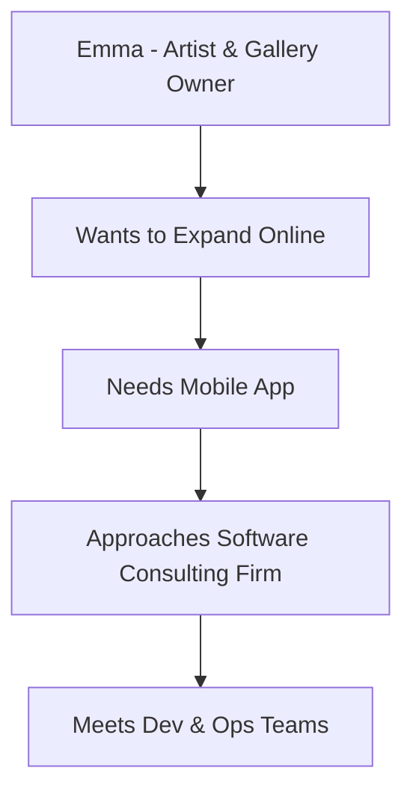
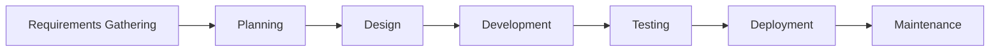
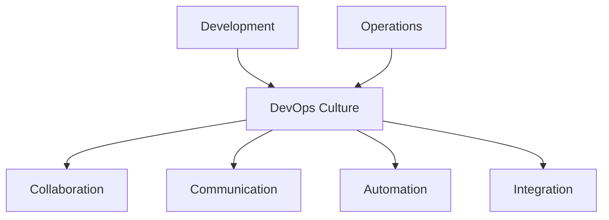
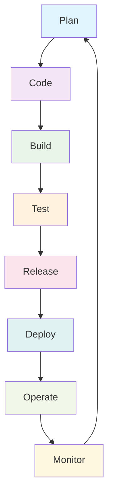
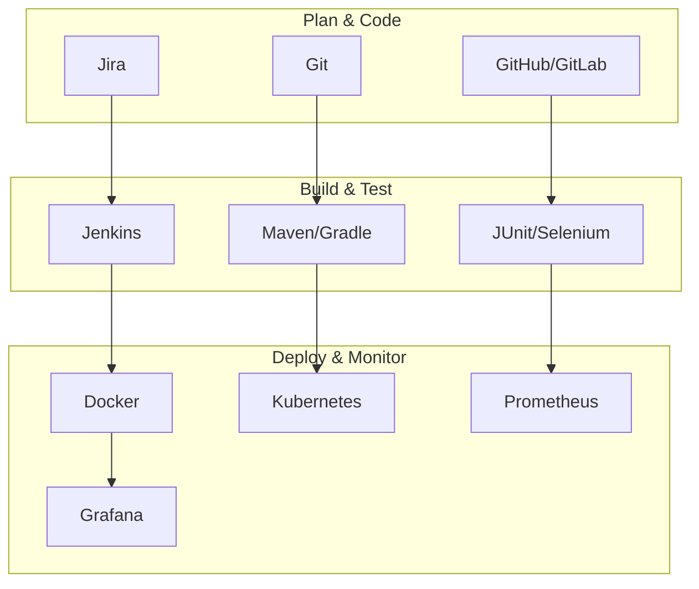
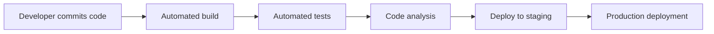
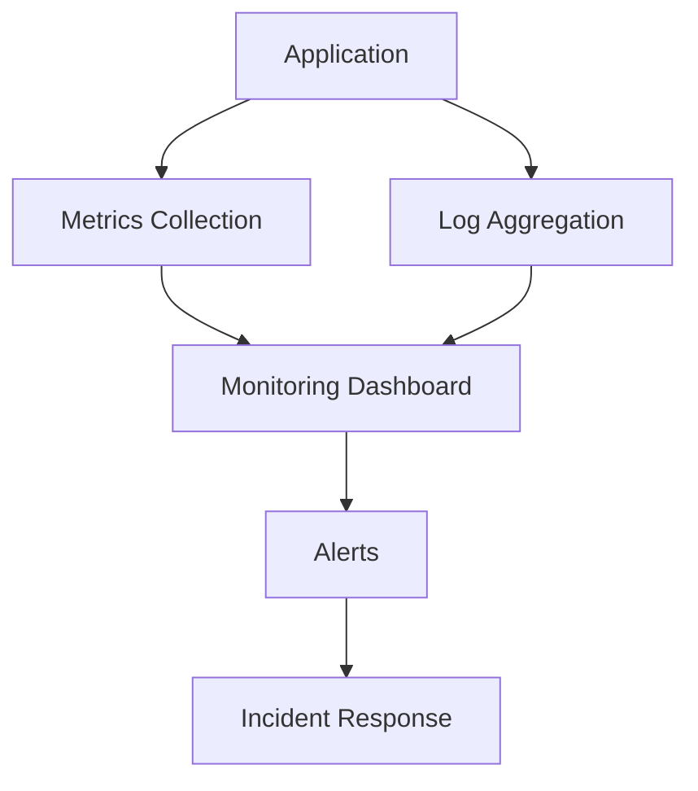

# DevOps Tutorial: From Traditional Development to Modern Collaboration


## 📖 Table of Contents
- [Introduction](#introduction)
- [The Story of Emma's Art Gallery](#the-story-of-emmas-art-gallery)
- [Traditional Software Development](#traditional-software-development)
- [The Problems with Traditional Approach](#the-problems-with-traditional-approach)
- [What is DevOps?](#what-is-devops)
- [DevOps Benefits](#devops-benefits)
- [DevOps Tools and Technologies](#devops-tools-and-technologies)
- [DevOps Best Practices](#devops-best-practices)
- [Interview Questions](#interview-questions)

## Introduction

**DevOps can accomplish tasks in minutes that used to take hours or even days!** This revolutionary approach allows companies to focus more on their business and products, which is why the IT industry is adopting DevOps at such a rapid pace.

> **Did you know?** Thousands of companies are evolving and adopting DevOps culture to stay competitive in today's fast-paced digital world.

## The Story of Emma's Art Gallery

Let me tell you a story about Emma, an artist with a passion for collecting artworks.



Emma owns an art gallery where she sells artwork to the public. She wants to expand her business online through a mobile app so users worldwide can access her gallery and make purchases.

### The Team

| Role | Name | Responsibility |
|------|------|---------------|
| 👨‍💼 Director | Reggie | Dev and Ops Team Management |
| 👨‍💻 Project Manager | Avi | Software Development Process |
| 🛠️ Operations Head | Freddy | Cloud Server Hosting |

## Traditional Software Development

Emma learns about the Software Development Life Cycle (SDLC), a well-defined and organized process:

### SDLC Phases



#### 1. 📋 Requirements Gathering & Analysis
- Collect product features for users
- Understand how it will be used
- Analyze user requirements
- Study current market state

#### 2. 📊 Planning
- Determine what we want to achieve
- Calculate cost and resources required
- Identify risks associated with implementation

#### 3. 🎨 Design
- Architects design the software
- Create design documents
- Provide roadmap for developers

#### 4. 💻 Development
- Developers write software code
- Follow design specifications
- Create the actual product

#### 5. 🧪 Testing
- Software testers check for defects
- Fix all issues before production
- Ensure quality standards

#### 6. 🚀 Deployment
- Deploy to production environment
- Make software available to users

#### 7. 🔧 Maintenance
- Balance regular changes and uptime
- Ongoing support and updates

## SDLC Models Comparison

### Waterfall vs Agile

| Aspect | Waterfall | Agile |
|--------|-----------|-------|
| **Approach** | Sequential phases | Iterative development |
| **Flexibility** | Difficult to change | Highly adaptable |
| **Delivery** | Working software late in cycle | Working software every 2-4 weeks |
| **Customer Involvement** | Limited after requirements | Continuous feedback |

```mermaid
gantt
    title Waterfall vs Agile Approach
    dateFormat X
    axisFormat %s
    
    section Waterfall
    Requirements    :0, 30
    Planning       :30, 60
    Development    :60, 150
    Testing        :150, 180
    Deployment     :180, 200
    
    section Agile
    Sprint 1       :0, 30
    Sprint 2       :30, 60
    Sprint 3       :60, 90
    Sprint 4       :90, 120
```



Emma chose **Agile** because she wasn't sure about all requirements upfront and wanted to observe product development while adding new ideas along the way.

## The Problems with Traditional Approach

### The Wall of Confusion 🧱

```mermaid
graph LR
    subgraph "Development Team"
        A[Agile Methodology]
        B[Quick Changes]
        C[Regular Updates]
    end
    
    subgraph "Wall of Confusion"
        D[❌ Poor Communication]
        E[❌ Deployment Delays]
        F[❌ Unclear Instructions]
    end
    
    subgraph "Operations Team"
        G[ITIL-Driven]
        H[Stable Environment]
        I[Production Support]
    end
    
    A --> D
    B --> E
    C --> F
    D --> G
    E --> H
    F --> I
```




### Common Issues:
- **Developers complain:** Delays in deployments
- **Ops team complains:** Unclear instructions, work "thrown over the wall"
- **Business impact:** Unhappy customers, direct business loss
- **Result:** Emma's customers want to use the app, but face frequent delays and errors

## What is DevOps?

DevOps is a cultural and technical movement that emphasizes **collaboration**, **communication**, and **automation** between Development and Operations teams.

### DevOps = Development + Operations



### Key Principles:

| Principle | Description |
|-----------|-------------|
| 🤝 **Collaboration** | Dev and Ops work together as one team |
| 📢 **Communication** | Effective information sharing |
| 🤖 **Automation** | Automate repetitive tasks |
| 🔄 **Integration** | Integrated delivery process |
| 📊 **Monitoring** | Continuous monitoring and feedback |

## DevOps Benefits

### Before DevOps vs After DevOps

| Metric | Before DevOps | After DevOps |
|--------|---------------|--------------|
| **Deployment Time** | Hours/Days | Minutes |
| **Error Rate** | High (Human errors) | Low (Automated) |
| **Customer Satisfaction** | Low | High |
| **Team Collaboration** | Poor | Excellent |
| **Time to Market** | Slow | Fast |

### The Automated DevOps Lifecycle



### Benefits Achieved:
✅ **No Human Intervention** - Fully automated process  
✅ **No Human Errors** - Consistent and reliable  
✅ **Repeatable Process** - Same results every time  
✅ **Time Saver** - Rapid delivery cycles  
✅ **Happy Customers** - Quick feature delivery  

## DevOps Tools and Technologies

### DevOps Toolchain



### Popular DevOps Tools by Category:

| Category | Tools |
|----------|-------|
| **Version Control** | Git, SVN, Mercurial |
| **CI/CD** | Jenkins, GitLab CI, Azure DevOps, GitHub Actions |
| **Containerization** | Docker, Podman |
| **Orchestration** | Kubernetes, Docker Swarm |
| **Infrastructure as Code** | Terraform, Ansible, CloudFormation |
| **Monitoring** | Prometheus, Grafana, ELK Stack |
| **Cloud Platforms** | AWS, Azure, Google Cloud |

## DevOps Best Practices

### 1. Continuous Integration/Continuous Deployment (CI/CD)



### 2. Infrastructure as Code (IaC)

```yaml
# Example Terraform configuration
resource "aws_instance" "web_server" {
  ami           = "ami-0c55b159cbfafe1d0"
  instance_type = "t2.micro"
  
  tags = {
    Name = "WebServer"
    Environment = "Production"
  }
}
```

### 3. Monitoring and Logging



### 4. Cultural Transformation

- **Break down silos** between teams
- **Shared responsibility** for product success
- **Continuous learning** and improvement
- **Blameless culture** for faster problem resolution

## Emma's Success Story

After implementing DevOps:


Emma can now deliver any request very quickly because everything is automated. Her customers are happy, and her idea has become a full-fledged business!

---

## 🎯 Interview Questions

### Beginner Level

**Q1: What is DevOps?**
**A:** DevOps is a cultural and technical movement that combines Development (Dev) and Operations (Ops) teams to improve collaboration, communication, and automation throughout the software delivery lifecycle.

**Q2: What are the main benefits of DevOps?**
**A:** 
- Faster time to market
- Improved collaboration between teams
- Higher quality software through automation
- Better customer satisfaction
- Reduced deployment failures
- Faster recovery from failures

**Q3: Explain the DevOps lifecycle.**
**A:** The DevOps lifecycle includes: Plan → Code → Build → Test → Release → Deploy → Operate → Monitor, forming a continuous loop.

**Q4: What is CI/CD?**
**A:** 
- **CI (Continuous Integration)**: Developers frequently integrate code changes into a shared repository, with automated builds and tests
- **CD (Continuous Deployment/Delivery)**: Automated deployment of code changes to production after passing tests

**Q5: Name some popular DevOps tools.**
**A:** Git, Jenkins, Docker, Kubernetes, Ansible, Terraform, Prometheus, Grafana, AWS/Azure/GCP.

### Intermediate Level

**Q6: What is Infrastructure as Code (IaC)?**
**A:** IaC is the practice of managing and provisioning computing infrastructure through machine-readable definition files, rather than physical hardware configuration or interactive configuration tools.

**Q7: Explain the difference between Continuous Delivery and Continuous Deployment.**
**A:** 
- **Continuous Delivery**: Code changes are automatically prepared for production release but require manual approval for deployment
- **Continuous Deployment**: Code changes are automatically deployed to production after passing all tests

**Q8: What is containerization and how does it help DevOps?**
**A:** Containerization packages applications with their dependencies into lightweight, portable containers. It helps DevOps by ensuring consistency across environments, improving scalability, and simplifying deployment.

**Q9: What are the key metrics to measure DevOps success?**
**A:**
- Lead time for changes
- Deployment frequency
- Mean time to recovery (MTTR)
- Change failure rate
- Application performance metrics

**Q10: How do you handle secrets management in DevOps?**
**A:** Use dedicated secret management tools like HashiCorp Vault, AWS Secrets Manager, or Azure Key Vault. Never store secrets in code repositories or plain text files.

### Advanced Level

**Q11: Explain Blue-Green Deployment strategy.**
**A:** Blue-Green deployment maintains two identical production environments. At any time, only one (Blue) serves production traffic. New versions are deployed to the inactive environment (Green), tested, and then traffic is switched over.

**Q12: What is GitOps and how does it differ from traditional DevOps?**
**A:** GitOps uses Git as the single source of truth for infrastructure and application deployment. Changes are made through Git commits, and automated systems ensure the actual state matches the desired state defined in Git.

**Q13: How do you implement security in DevOps (DevSecOps)?**
**A:** 
- Integrate security testing into CI/CD pipelines
- Use static code analysis tools
- Implement container scanning
- Regular dependency vulnerability checks
- Infrastructure security scanning
- Implement least privilege access

**Q14: Explain microservices architecture in the context of DevOps.**
**A:** Microservices break applications into small, independent services. DevOps practices like containerization, CI/CD, and automated testing become crucial for managing the complexity of multiple services.

**Q15: How do you handle database changes in DevOps?**
**A:** 
- Database migration scripts in version control
- Automated database deployments
- Database rollback strategies
- Environment parity for databases
- Database testing in CI/CD pipelines

### Scenario-Based Questions

**Q16: Your deployment pipeline is failing 50% of the time. How would you troubleshoot?**
**A:**
1. Analyze failure patterns and logs
2. Check environment consistency
3. Review test coverage and quality
4. Examine infrastructure stability
5. Implement better monitoring and alerting
6. Consider rollback strategies

**Q17: How would you migrate a monolithic application to DevOps practices?**
**A:**
1. Start with CI/CD for the monolith
2. Implement automated testing
3. Containerize the application
4. Add monitoring and logging
5. Gradually break into microservices
6. Implement service-to-service communication

**Q18: A critical production issue occurs at 3 AM. Describe your incident response process.**
**A:**
1. Automated alerting triggers response
2. On-call engineer investigates
3. Escalate if needed following runbooks
4. Implement quick fix or rollback
5. Communicate with stakeholders
6. Conduct post-incident review
7. Update processes to prevent recurrence

---

## 📚 Additional Resources

- [DevOps Handbook](https://itrevolution.com/the-devops-handbook/)
- [The Phoenix Project](https://itrevolution.com/the-phoenix-project/)
- [AWS DevOps](https://aws.amazon.com/devops/)
- [Azure DevOps](https://azure.microsoft.com/en-us/services/devops/)
- [Google Cloud DevOps](https://cloud.google.com/devops)

---

## 🎉 Conclusion

DevOps is not just about tools and technology—it's about cultural transformation, collaboration, and continuous improvement. Just like Emma's success story, organizations that embrace DevOps practices can deliver value faster, improve customer satisfaction, and build more resilient systems.

Remember: **DevOps is a journey, not a destination!**

---

*Happy DevOps-ing! 🚀*
