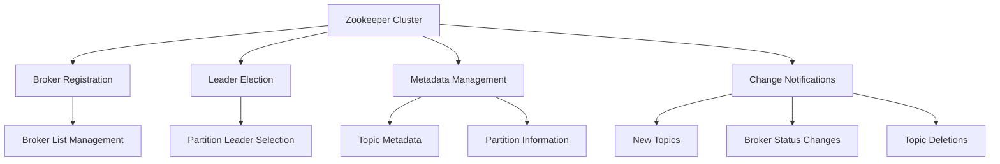

# Kafka Zookeeper: Understanding the Legacy and the Future

## Overview

Zookeeper has been the backbone of Apache Kafka since its inception, managing broker metadata and coordination. However, the Kafka ecosystem is transitioning away from Zookeeper dependency with the introduction of Kafka Raft (KRaft) mode. This tutorial covers everything you need to know about Zookeeper's role in Kafka and the ongoing transition.

## What is Zookeeper?

Zookeeper is a centralized service for maintaining configuration information, naming, providing distributed synchronization, and group services. In the Kafka ecosystem, it serves as the coordination layer for Kafka brokers.

## Zookeeper's Role in Kafka

### Core Responsibilities



### 1. Broker Management
- **Maintains broker registry**: Keeps track of all active Kafka brokers
- **Health monitoring**: Detects when brokers join or leave the cluster
- **Broker metadata**: Stores broker configuration and status information

### 2. Leader Election
- **Partition leadership**: Manages which broker leads each partition
- **Automatic failover**: Elects new leaders when current leaders fail
- **Ensures consistency**: Maintains single leader per partition

### 3. Configuration Management
- **Topic metadata**: Stores topic configurations and partition assignments
- **Access control**: Manages security configurations and permissions
- **Dynamic configuration**: Handles configuration updates across the cluster

### 4. Change Notifications
- **Real-time updates**: Notifies brokers of cluster changes
- **Event propagation**: Ensures all brokers stay synchronized
- **State consistency**: Maintains consistent view across the cluster

## Zookeeper Architecture

### Cluster Design

```
┌─────────────────────────────────────────────────────┐
│                Zookeeper Cluster                   │
│                                                     │
│  ┌─────────────┐  ┌─────────────┐  ┌─────────────┐ │
│  │     ZK1     │  │     ZK2     │  │     ZK3     │ │
│  │  (Follower) │  │  (Leader)   │  │  (Follower) │ │
│  └─────────────┘  └─────────────┘  └─────────────┘ │
│         │                │                │        │
└─────────┼────────────────┼────────────────┼────────┘
          │                │                │
    ┌─────┼────────────────┼────────────────┼─────┐
    │     │                │                │     │
    │  ┌──▼──┐          ┌──▼──┐          ┌──▼──┐  │
    │  │ B101│          │ B102│          │ B103│  │
    │  └─────┘          └─────┘          └─────┘  │
    │           Kafka Broker Cluster             │
    └─────────────────────────────────────────────┘
```

### Key Characteristics

- **Odd number of servers**: Always deploy 1, 3, 5, or 7 Zookeeper nodes (never more than 7)
- **Leader/Follower model**: One leader handles writes, followers serve reads
- **Quorum-based**: Requires majority of nodes to be available for operations

## Historical Context and Evolution

### Timeline

```
Kafka 0.x - 2.x     │ Zookeeper Required
                    │ ├─ Brokers depend on Zookeeper
                    │ ├─ Consumers stored offsets in Zookeeper (< 0.10)
                    │ └─ All coordination via Zookeeper
                    │
Kafka 3.x          │ KRaft Mode Introduction
                    │ ├─ Optional Zookeeper-less operation
                    │ ├─ Preview/experimental feature
                    │ └─ Production workloads still use Zookeeper
                    │
Kafka 4.x (Future) │ Zookeeper Removal
                    │ ├─ KRaft becomes default
                    │ └─ Zookeeper support deprecated
```

### Consumer Offset Evolution

#### Before Kafka 0.10
```
┌─────────────┐    offsets    ┌─────────────┐
│   Consumer  │ ─────────────▶│  Zookeeper  │
└─────────────┘               └─────────────┘
```

#### After Kafka 0.10 (Current)
```
┌─────────────┐    offsets    ┌─────────────────┐
│   Consumer  │ ─────────────▶│ __consumer_     │
└─────────────┘               │ _offsets topic  │
                              └─────────────────┘
```

**Important**: Zookeeper no longer stores consumer offset data since Kafka 0.10

## Client Connection Evolution

### Legacy Connection Pattern (Deprecated)
```
┌─────────────────┐
│ Kafka Clients   │
├─────────────────┤    ❌ DEPRECATED
│ • Producers     │ ──────────┐
│ • Consumers     │           │
│ • Admin Tools   │           ▼
└─────────────────┘    ┌─────────────┐
                       │  Zookeeper  │
                       └─────────────┘
```

### Modern Connection Pattern (Current)
```
┌─────────────────┐
│ Kafka Clients   │
├─────────────────┤    ✅ CURRENT
│ • Producers     │ ──────────┐
│ • Consumers     │           │
│ • Admin Tools   │           ▼
└─────────────────┘    ┌─────────────┐
                       │    Kafka    │
                       │   Brokers   │
                       └─────────────┘
```

## KRaft Mode: The Future of Kafka

### What is KRaft?

**KRaft** (Kafka Raft) is Kafka's built-in consensus mechanism that replaces Zookeeper dependency.

- **Reference**: KIP-500 (Kafka Improvement Proposal)
- **Goal**: Remove external Zookeeper dependency
- **Benefits**: Simplified deployment, better scalability, enhanced security

### KRaft Architecture

```
┌─────────────────────────────────────────────────────┐
│                 KRaft Kafka Cluster                │
│                                                     │
│  ┌─────────────┐  ┌─────────────┐  ┌─────────────┐ │
│  │   Broker    │  │   Broker    │  │   Broker    │ │
│  │ (Controller)│  │   (Data)    │  │   (Data)    │ │
│  └─────────────┘  └─────────────┘  └─────────────┘ │
│                                                     │
│  Built-in Raft consensus, no external dependency   │
└─────────────────────────────────────────────────────┘
```

## Production Recommendations

### Current Best Practices (2024)

| Kafka Version | Recommendation | Reason |
|---------------|----------------|--------|
| **2.x** | ✅ Use Zookeeper | Required, no alternative |
| **3.x** | ✅ Use Zookeeper | KRaft not production-ready |
| **4.x (Future)** | ✅ Use KRaft | Zookeeper deprecated |

### Security Considerations

```
┌─────────────────────────────────────────────┐
│            Security Best Practices          │
├─────────────────────────────────────────────┤
│                                             │
│  Zookeeper Network Access:                 │
│  ├─ ✅ Allow: Kafka Brokers                │
│  └─ ❌ Block: Kafka Clients                │
│                                             │
│  Reason: Zookeeper less secure than Kafka  │
│                                             │
└─────────────────────────────────────────────┘
```

## Migration Timeline

### Phase 1: Current (Kafka 3.x)
```
Production: Kafka + Zookeeper
Development: Can experiment with KRaft
Testing: Both modes available
```

### Phase 2: Transition (Kafka 4.x)
```
Production: Migrate to KRaft
Development: KRaft default
Testing: Zookeeper deprecated
```

### Phase 3: Future
```
All environments: KRaft only
Zookeeper: Completely removed
```

## Common Configuration Examples

### Zookeeper Connection String
```properties
# Legacy (Don't use for clients)
zookeeper.connect=zoo1:2181,zoo2:2181,zoo3:2181

# Modern (Use this for all clients)
bootstrap.servers=kafka1:9092,kafka2:9092,kafka3:9092
```

### Kafka CLI Commands Evolution

#### Before Kafka 2.2 (Legacy)
```bash
# ❌ Old way - Don't use
kafka-topics.sh --zookeeper zoo1:2181 --list
```

#### After Kafka 2.2 (Current)
```bash
# ✅ Modern way - Use this
kafka-topics.sh --bootstrap-server kafka1:9092 --list
```

## Hands-on Examples

### Starting Kafka with Zookeeper (Traditional)
```bash
# Start Zookeeper
bin/zookeeper-server-start.sh config/zookeeper.properties

# Start Kafka
bin/kafka-server-start.sh config/server.properties
```

### Starting Kafka with KRaft (Experimental)
```bash
# Generate cluster ID
KAFKA_CLUSTER_ID="$(bin/kafka-storage.sh random-uuid)"

# Format storage
bin/kafka-storage.sh format -t $KAFKA_CLUSTER_ID -c config/kraft/server.properties

# Start Kafka (no Zookeeper needed)
bin/kafka-server-start.sh config/kraft/server.properties
```

## Key Takeaways

### ✅ Best Practices

1. **Never connect clients to Zookeeper** - Always use Kafka brokers
2. **Use bootstrap.servers** - Not zookeeper.connect in client configurations  
3. **Secure Zookeeper access** - Limit to broker-only connections
4. **Stay updated** - Monitor KRaft production readiness
5. **Plan migration** - Prepare for eventual Zookeeper removal

### ❌ Common Mistakes

1. **Client Zookeeper connections** - Outdated and insecure approach
2. **Mixed connection patterns** - Inconsistent client configurations
3. **Ignoring migration timeline** - Not preparing for KRaft transition
4. **Security oversight** - Exposing Zookeeper to client networks

## Summary

Zookeeper has been essential to Kafka's operation but is being phased out in favor of KRaft mode. For production systems today, continue using Zookeeper while preparing for the eventual migration to KRaft. Always connect clients directly to Kafka brokers, never to Zookeeper, to ensure compatibility with future Kafka versions.

Understanding both Zookeeper's current role and the KRaft transition is crucial for any Kafka developer working with modern distributed systems.
