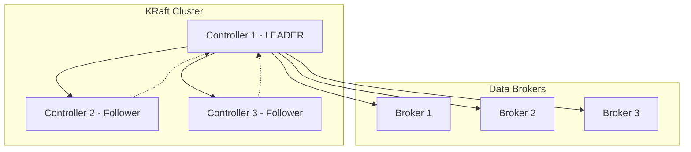

# Kafka KRaft Mode: The Future of Apache Kafka

## Overview

KRaft (Kafka Raft) mode represents a major architectural shift in Apache Kafka, eliminating the dependency on Apache Zookeeper. This tutorial covers the motivation, architecture, benefits, and practical implementation of KRaft mode.

## Historical Context and Motivation

### The Journey to KRaft

```
2020: KIP-500 Initiated
├─ Goal: Remove Zookeeper dependency
├─ Address: Scaling limitations
└─ Improve: Operational simplicity

2021-2022: Development Phase
├─ Architecture design
├─ Implementation
└─ Testing and validation

2023: Production Ready
├─ Kafka 3.3.1: First production-ready release
├─ KIP-833: Production readiness
└─ Enterprise adoption begins

2024+: Future Direction
└─ Kafka 4.0: KRaft-only (No Zookeeper support)
```

### Why KRaft Was Needed

#### Scaling Limitations with Zookeeper

```
┌─────────────────────────────────────────────┐
│           Zookeeper Scaling Issues          │
├─────────────────────────────────────────────┤
│                                             │
│  Partitions: 100,000+ → Performance Issues │
│           ▼                                 │
│  ┌─────────────────────────────────────┐   │
│  │        Bottlenecks                  │   │
│  │ • Metadata operations slow          │   │
│  │ • Leader election delays            │   │
│  │ • Memory consumption high           │   │
│  │ • Network overhead significant      │   │
│  └─────────────────────────────────────┘   │
└─────────────────────────────────────────────┘
```

#### KRaft Solution

```
┌─────────────────────────────────────────────┐
│            KRaft Improvements               │
├─────────────────────────────────────────────┤
│                                             │
│  Partitions: Millions → No Performance Hit │
│           ▼                                 │
│  ┌─────────────────────────────────────┐   │
│  │          Benefits                   │   │
│  │ • Native Kafka protocol             │   │
│  │ • Efficient log-based storage       │   │
│  │ • Built-in consensus mechanism      │   │
│  │ • Simplified architecture           │   │
│  └─────────────────────────────────────┘   │
└─────────────────────────────────────────────┘
```

## Architecture Comparison

### Traditional Kafka with Zookeeper

```
┌─────────────────────────────────────────────────────┐
│                External Zookeeper Cluster          │
│  ┌─────────────┐  ┌─────────────┐  ┌─────────────┐ │
│  │     ZK1     │  │     ZK2     │  │     ZK3     │ │
│  │  (Follower) │  │  (Leader)   │  │  (Follower) │ │
│  └──────┬──────┘  └──────┬──────┘  └──────┬──────┘ │
└─────────┼─────────────────┼─────────────────┼────────┘
          │                 │                 │
          │    Coordination & Metadata        │
          ▼                 ▼                 ▼
┌─────────────────────────────────────────────────────┐
│                Kafka Broker Cluster                │
│  ┌─────────────┐  ┌─────────────┐  ┌─────────────┐ │
│  │   Broker1   │  │   Broker2   │  │   Broker3   │ │
│  │   (Data)    │  │   (Data)    │  │   (Data)    │ │
│  └─────────────┘  └─────────────┘  └─────────────┘ │
└─────────────────────────────────────────────────────┘

Issues:
• Two separate systems to manage
• Complex deployment and monitoring  
• Zookeeper scaling limitations
• Different security models
```

### KRaft Mode Architecture

```
┌─────────────────────────────────────────────────────┐
│              Unified Kafka Cluster                 │
│  ┌─────────────┐  ┌─────────────┐  ┌─────────────┐ │
│  │   Broker1   │  │   Broker2   │  │   Broker3   │ │
│  │(Controller +│  │   (Data +   │  │   (Data +   │ │
│  │ Data) LEADER│  │ Controller) │  │ Controller) │ │
│  └─────────────┘  └─────────────┘  └─────────────┘ │
│                                                     │
│  Built-in Raft Consensus for Coordination          │
└─────────────────────────────────────────────────────┘

Benefits:
• Single system to manage
• Native Kafka protocol throughout
• No external dependencies
• Unified security model
• Simplified operations
```

## KRaft Components and Concepts

### Controller Quorum



### Node Types in KRaft

#### 1. Controller Nodes
```
┌─────────────────────────────────────┐
│         Controller Node             │
├─────────────────────────────────────┤
│ Responsibilities:                   │
│ • Metadata management               │
│ • Leader election                   │
│ • Configuration changes             │
│ • Cluster coordination              │
│                                     │
│ Role: process.roles=controller      │
└─────────────────────────────────────┘
```

#### 2. Broker Nodes  
```
┌─────────────────────────────────────┐
│           Broker Node               │
├─────────────────────────────────────┤
│ Responsibilities:                   │
│ • Data storage                      │
│ • Client requests                   │
│ • Partition leadership              │
│ • Data replication                  │
│                                     │
│ Role: process.roles=broker          │
└─────────────────────────────────────┘
```

#### 3. Combined Nodes
```
┌─────────────────────────────────────┐
│        Combined Node                │
├─────────────────────────────────────┤
│ Responsibilities:                   │
│ • All controller functions          │
│ • All broker functions              │
│ • Dual role capability             │
│                                     │
│ Role: process.roles=controller,broker│
└─────────────────────────────────────┘
```

## Version Timeline and Production Readiness

### KRaft Evolution Timeline

```
Kafka 3.0 (September 2021)
├─ KRaft mode introduced
├─ Status: Early Access / Preview
└─ Use case: Development and testing only

Kafka 3.1 (January 2022)  
├─ Stability improvements
├─ Status: Still preview
└─ Use case: Advanced testing

Kafka 3.2 (May 2022)
├─ Feature completeness improved
├─ Status: Pre-production
└─ Use case: Staging environments

Kafka 3.3.1 (October 2022) ⭐
├─ Production ready milestone (KIP-833)
├─ Status: Production ready
└─ Use case: Production workloads approved

Kafka 4.0 (Future)
├─ Zookeeper support removed
├─ Status: KRaft only
└─ Use case: All deployments mandatory KRaft
```

## Performance Improvements

### Controller Performance Comparison

```
┌─────────────────────────────────────────────────────┐
│              Performance Metrics                   │
├─────────────────────────────────────────────────────┤
│                                                     │
│  Controller Shutdown Time:                         │
│  ┌─────────────────┐ vs ┌──────────────────────────┐│
│  │   Zookeeper     │    │         KRaft            ││
│  │   ~5-10 min     │    │       ~1-2 sec          ││
│  └─────────────────┘    └──────────────────────────┘│
│                                                     │
│  Recovery Time (Uncontrolled Shutdown):            │
│  ┌─────────────────┐ vs ┌──────────────────────────┐│
│  │   Zookeeper     │    │         KRaft            ││
│  │   ~5-15 min     │    │       ~30 sec           ││
│  └─────────────────┘    └──────────────────────────┘│
│                                                     │
│  Partition Scale:                                   │
│  ┌─────────────────┐ vs ┌──────────────────────────┐│
│  │   Zookeeper     │    │         KRaft            ││
│  │   ~100K max     │    │      Millions           ││
│  └─────────────────┘    └──────────────────────────┘│
└─────────────────────────────────────────────────────┘
```

### Throughput and Latency Benefits

```
Performance Area          │ Zookeeper Mode │ KRaft Mode    │ Improvement
─────────────────────────────────────────────────────────────────────────
Metadata Operations/sec   │     1,000      │    50,000     │    50x
Leader Election Time      │   10-30 sec    │   1-3 sec     │   10x  
Partition Creation Rate   │     100/sec    │   10,000/sec  │  100x
Memory Efficiency         │    Baseline    │     -30%      │ Better
Network Overhead          │    Baseline    │     -50%      │ Better
```

## KRaft Configuration

### Basic KRaft Configuration

```properties
# server.properties for KRaft mode

# Node roles - can be controller, broker, or both
process.roles=controller,broker

# Node ID - must be unique across cluster
node.id=1

# Controller quorum configuration  
controller.quorum.voters=1@localhost:9093,2@host2:9093,3@host3:9093

# Listeners
listeners=PLAINTEXT://localhost:9092,CONTROLLER://localhost:9093
advertised.listeners=PLAINTEXT://localhost:9092
listener.security.protocol.map=CONTROLLER:PLAINTEXT,PLAINTEXT:PLAINTEXT

# Controller listener
controller.listener.names=CONTROLLER

# Log directories
log.dirs=/tmp/kraft-combined-logs

# Cluster ID (generated once, shared across all nodes)
cluster.id=MkU3OEVBNTcwNTJENDM2Qk
```

### Deployment Topologies

#### Small Cluster (Development/Testing)
```
┌─────────────────────────────────────┐
│          3-Node Cluster             │
│  ┌─────────┐  ┌─────────┐  ┌─────────┐
│  │  Node1  │  │  Node2  │  │  Node3  │
│  │Controller│  │Controller│  │Controller│
│  │   +     │  │   +     │  │   +     │
│  │ Broker  │  │ Broker  │  │ Broker  │
│  └─────────┘  └─────────┘  └─────────┘
└─────────────────────────────────────┘

Configuration: process.roles=controller,broker
Benefits: Simple setup, cost-effective
Use case: Development, small production
```

#### Large Cluster (Enterprise Production)
```
┌─────────────────────────────────────────────────────┐
│                Dedicated Architecture              │
│                                                     │
│  Controllers (Metadata Management)                 │
│  ┌─────────┐  ┌─────────┐  ┌─────────┐            │
│  │   C1    │  │   C2    │  │   C3    │            │
│  │(Leader) │  │(Follower│  │(Follower│            │
│  └─────────┘  └─────────┘  └─────────┘            │
│       │           │           │                   │
│       └───────────┼───────────┘                   │
│                   │                               │
│  Data Brokers (Client Serving)                    │
│  ┌─────────┐  ┌─────────┐  ┌─────────┐  ┌─────────┐│
│  │   B1    │  │   B2    │  │   B3    │  │   B4    │││
│  │ (Data)  │  │ (Data)  │  │ (Data)  │  │ (Data)  ││
│  └─────────┘  └─────────┘  └─────────┘  └─────────┘│
└─────────────────────────────────────────────────────┘

Controllers: process.roles=controller
Brokers: process.roles=broker
Benefits: Better isolation, optimized performance
Use case: Large-scale production
```

## Setup and Migration

### Fresh KRaft Installation

#### Step 1: Generate Cluster ID
```bash
# Generate a unique cluster ID
KAFKA_CLUSTER_ID="$(bin/kafka-storage.sh random-uuid)"
echo "Cluster ID: $KAFKA_CLUSTER_ID"

# Example output: MkU3OEVBNTcwNTJENDM2Qk
```

#### Step 2: Format Storage
```bash
# Format the storage directories
bin/kafka-storage.sh format \
  -t $KAFKA_CLUSTER_ID \
  -c config/kraft/server.properties

# Output: Formatting storage successful
```

#### Step 3: Start Kafka
```bash
# Start Kafka in KRaft mode (no Zookeeper needed!)
bin/kafka-server-start.sh config/kraft/server.properties
```

### Migration from Zookeeper to KRaft

#### Migration Overview
```
┌─────────────────────────────────────────────────────┐
│                Migration Process                   │
├─────────────────────────────────────────────────────┤
│                                                     │
│  Phase 1: Planning                                  │
│  ├─ Assess current cluster                          │
│  ├─ Plan downtime window                            │
│  └─ Backup configurations                           │
│                                                     │
│  Phase 2: Preparation                               │
│  ├─ Upgrade to Kafka 3.3.1+                        │
│  ├─ Test in staging environment                     │
│  └─ Prepare KRaft configurations                    │
│                                                     │
│  Phase 3: Migration (Downtime Required)            │
│  ├─ Export metadata from Zookeeper                 │
│  ├─ Convert to KRaft format                         │
│  ├─ Start KRaft cluster                             │
│  └─ Verify functionality                            │
│                                                     │
│  Phase 4: Validation                                │
│  ├─ Test all functionality                          │
│  ├─ Monitor performance                             │
│  └─ Update client configurations                    │
└─────────────────────────────────────────────────────┘
```

## Benefits Summary

### Operational Benefits

```
┌─────────────────────────────────────────────┐
│            KRaft Advantages                 │
├─────────────────────────────────────────────┤
│                                             │
│  🚀 Simplified Architecture                │
│  ├─ Single system to manage               │
│  ├─ No external dependencies              │
│  └─ Unified deployment process            │
│                                             │
│  ⚡ Performance Improvements               │
│  ├─ Faster controller operations          │
│  ├─ Reduced network overhead              │
│  └─ Better resource utilization           │
│                                             │
│  🔒 Enhanced Security                      │
│  ├─ Single security model                 │
│  ├─ No Zookeeper attack surface          │
│  └─ Native Kafka security features       │
│                                             │
│  📈 Better Scalability                    │
│  ├─ Millions of partitions support       │
│  ├─ Improved metadata handling           │
│  └─ Linear scaling characteristics       │
│                                             │
│  🛠️ Operational Excellence                │
│  ├─ Easier monitoring                     │
│  ├─ Simplified troubleshooting           │
│  └─ Reduced operational complexity        │
└─────────────────────────────────────────────┘
```

## Monitoring KRaft Clusters

### Key Metrics to Monitor

```properties
# Controller-specific metrics
kafka.controller:type=KafkaController,name=ActiveControllerCount
kafka.controller:type=ControllerStats,name=LeaderElectionRateAndTimeMs

# Metadata log metrics  
kafka.server:type=KafkaRaftServer,name=MetadataLoadErrorCount
kafka.server:type=BrokerMetadataListener,name=MetadataApplyErrorCount

# Quorum metrics
kafka.raft:type=Raft,name=LeaderElectionRateAndTimeMs
kafka.raft:type=Raft,name=CommitLatencyMs
```

### Health Checks

```bash
# Check controller status
kafka-metadata-shell.sh --snapshot /path/to/metadata/logs

# Verify cluster metadata
kafka-cluster.sh cluster-id --bootstrap-server localhost:9092

# Check controller quorum
kafka-leader-election.sh --bootstrap-server localhost:9092
```

## Best Practices

### ✅ Production Guidelines

1. **Use Dedicated Controllers** for large clusters (>10 brokers)
2. **Maintain Odd Number** of controller nodes (3 or 5)
3. **Monitor Controller Health** continuously  
4. **Plan Capacity** for metadata storage growth
5. **Backup Metadata Logs** regularly
6. **Test Failover Scenarios** in staging
7. **Use Kafka 3.3.1+** for production workloads

### ❌ Common Pitfalls

1. **Even number of controllers** - Can cause split-brain
2. **Mixed mode clusters** - Zookeeper + KRaft simultaneously  
3. **Insufficient controller resources** - Under-provisioned controllers
4. **No metadata backup strategy** - Risk of metadata loss
5. **Skipping staging tests** - Deploy without validation
6. **Using preview versions** - Production on non-stable releases

## Future Roadmap

### Kafka 4.0 and Beyond

```
┌─────────────────────────────────────────────────────┐
│                 Kafka 4.0 Changes                  │
├─────────────────────────────────────────────────────┤
│                                                     │
│  🚫 Zookeeper Support Removed                      │
│  ├─ No backward compatibility                      │
│  ├─ KRaft-only deployments                         │
│  └─ Migration required for all clusters            │
│                                                     │
│  🆕 Enhanced KRaft Features                        │
│  ├─ Improved performance optimizations             │
│  ├─ Advanced security features                     │
│  └─ Better operational tooling                     │
│                                                     │
│  📊 Ecosystem Integration                          │
│  ├─ Updated monitoring tools                       │
│  ├─ Enhanced management interfaces                 │
│  └─ Improved cloud-native support                  │
└─────────────────────────────────────────────────────┘
```

## Summary

KRaft mode represents the evolution of Apache Kafka architecture, eliminating Zookeeper dependency while providing significant improvements in scalability, performance, and operational simplicity. With production readiness achieved in Kafka 3.3.1 and mandatory adoption coming in Kafka 4.0, understanding and implementing KRaft is essential for modern Kafka deployments.

The transition from Zookeeper to KRaft marks a major milestone in Kafka's journey toward becoming a more streamlined, scalable, and maintainable distributed streaming platform.
