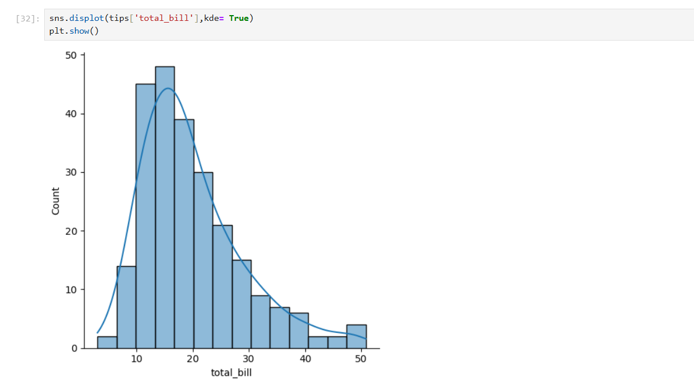
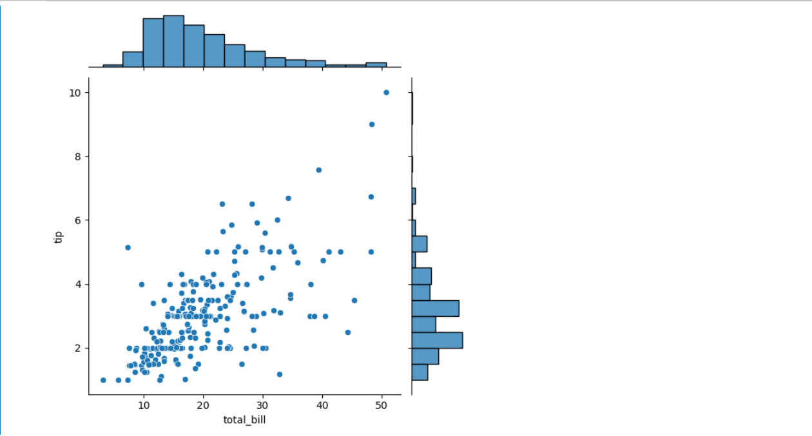
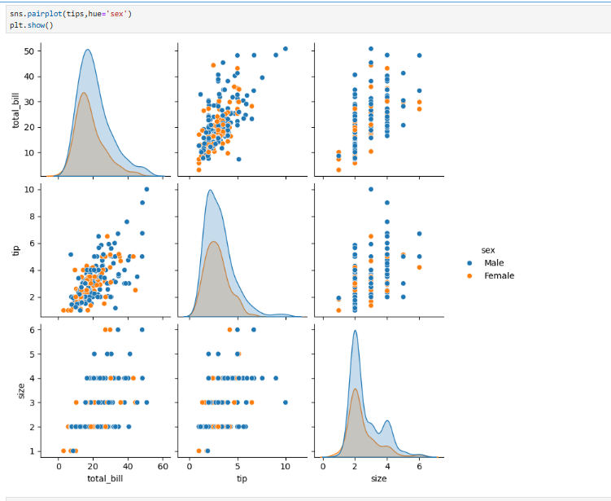

# Seaborn Data Visualization Tutorial - Part 1
*Python for Data Science Series*

## Table of Contents
1. [What is Seaborn?](#what-is-seaborn)
2. [Installation and Setup](#installation-and-setup)
3. [Distribution Plots](#distribution-plots)
4. [Categorical Plots](#categorical-plots)
5. [Matrix Plots (Heatmaps)](#matrix-plots-heatmaps)
6. [Grid Plots](#grid-plots)
7. [Regression Plots](#regression-plots)
8. [Style and Color Customization](#style-and-color-customization)

## What is Seaborn?

Seaborn is a powerful statistical data visualization library built on top of Matplotlib. It provides:

- **Beautiful default styles** - Your plots look professional right out of the box
- **Statistical plotting functions** - Built-in statistical capabilities
- **Pandas integration** - Works seamlessly with DataFrames
- **High-level interface** - Less code needed compared to Matplotlib

Think of Seaborn as Matplotlib's stylish cousin - it does everything Matplotlib does but with better defaults and easier syntax.

## Installation and Setup

### Installation Options

```bash
# If using Anaconda
conda install seaborn

# If using pip
pip install seaborn
```

### Basic Setup

```python
import seaborn as sns
import matplotlib.pyplot as plt
import pandas as pd
import numpy as np

# Enable inline plotting in Jupyter notebooks
%matplotlib inline

# Load sample dataset
tips = sns.load_dataset('tips')
print(tips.head())
```

**Output:**
```
   total_bill   tip     sex smoker  day    time  size
0       16.99  1.01  Female     No  Sun  Dinner     2
1       10.34  1.66    Male     No  Sun  Dinner     3
2       21.01  3.50    Male     No  Sun  Dinner     3
3       23.68  3.31    Male     No  Sun  Dinner     2
4       24.59  3.61  Female     No  Sun  Dinner     4
```

## Distribution Plots

Distribution plots help us understand how data is spread across different values.

### 1. Histogram with KDE (distplot)

The `distplot` combines a histogram with a Kernel Density Estimation (KDE) curve.

```python
# Basic distribution plot
plt.figure(figsize=(10, 6))
sns.distplot(tips['total_bill'])
plt.title('Distribution of Total Bill')
plt.show()
```

**What you'll see:** A histogram with a smooth curve overlay showing the distribution shape.

```python
# Histogram only (remove KDE)
plt.figure(figsize=(10, 6))
sns.distplot(tips['total_bill'], kde=False, bins=30)
plt.title('Histogram of Total Bill (30 bins)')
plt.show()
```

**Key Parameters:**
- `kde=False`: Remove the smooth curve
- `bins=30`: Control number of histogram bars
- More bins = more detail, but can become noisy

### 2. Joint Plots - Compare Two Variables

Joint plots show the relationship between two variables along with their individual distributions.

```python
# Scatter plot with marginal distributions
sns.jointplot(x='total_bill', y='tip', data=tips)
plt.show()
```


*Example of a joint plot showing the relationship between total_bill and tip*

**Understanding the Joint Plot Output:**

This jointplot combines three different visualizations into one comprehensive view:

**Main Plot (Center - Scatter Plot):**
- Each dot represents a single meal from the dataset
- X-axis: total_bill amount
- Y-axis: tip amount  
- Shows a **positive correlation** - as total_bill increases, tip tends to increase
- Points aren't perfectly aligned, indicating the relationship isn't deterministic, but there's a clear upward trend

**Top Plot (Histogram of total_bill):**
- Shows the distribution of total_bill values alone
- Most total bills fall in the $10-$30 range
- Distribution is **right-skewed** - few high-value bills, majority on the lower end

**Right Plot (Histogram of tip):**
- Shows the distribution of tip values alone  
- Most common tip amounts are between $2-$4
- Also **right-skewed** - most tips are lower, with fewer generous tips

**Key Insights from this Joint Plot:**
1. **Relationship**: Strong positive correlation between bill and tip amounts
2. **Bill Distribution**: Most meals are moderately priced ($10-$30)  
3. **Tip Distribution**: Most tips are modest ($2-$4) with occasional generous tips

```python
# Different joint plot types
plt.figure(figsize=(15, 4))

# Hexbin plot - good for large datasets
plt.subplot(1, 3, 1)
sns.jointplot(x='total_bill', y='tip', data=tips, kind='hex')

# Regression plot with line
plt.subplot(1, 3, 2)
sns.jointplot(x='total_bill', y='tip', data=tips, kind='reg')

# KDE plot - density contours
plt.subplot(1, 3, 3)
sns.jointplot(x='total_bill', y='tip', data=tips, kind='kde')
plt.show()
```

### 3. Pair Plots - Multiple Variable Relationships

Pair plots create scatter plots for every combination of numerical variables.

```python
# Basic pair plot
sns.pairplot(tips)
plt.show()
```

**Understanding the Pair Plot Structure:**

A pairplot is a grid where each cell shows relationships between variable pairs:

**Diagonal Plots:** Show the distribution of a single variable (usually histograms or KDE)
**Off-Diagonal Plots:** Show relationships between two different variables (scatter plots)

```python
# Add color coding by category
sns.pairplot(tips, hue='sex', palette='Set1')
plt.show()
```


*Example of a pair plot with gender-based color coding showing relationships between multiple variables*

**Detailed Analysis of the Pair Plot with Gender (hue='sex'):**

**Diagonal Plots (Variable Distributions):**
- **total_bill (top-left):** KDE plot showing total bills for both genders are right-skewed, with most bills in the $10-$30 range. Male and female curves largely overlap, suggesting similar spending patterns.
- **tip (middle-middle):** KDE showing right-skewed tip distribution ($2-$4 range) for both genders. Distributions are very similar between males and females.
- **size (bottom-right):** Shows that table size of 2 is most common for both genders, with similar distribution patterns.

**Off-Diagonal Plots (Variable Relationships):**
- **total_bill vs tip:** Strong positive correlation for both genders - as bills increase, tips increase proportionally
- **total_bill vs size:** Positive correlation - larger parties tend to have higher bills
- **tip vs size:** Positive correlation - larger parties tend to leave larger tips

**Key Insights from this Pair Plot:**
1. **Gender Impact:** Gender doesn't significantly affect spending patterns - male and female distributions are very similar
2. **Strong Correlations:** Clear positive relationships between all three variables (bill, tip, size)  
3. **Consistent Patterns:** The relationships hold true across both gender groups
4. **Logical Relationships:** Larger groups → higher bills → larger tips (makes intuitive sense)

**When to Use Pair Plots:**
- Exploring relationships in datasets with multiple numerical variables
- Identifying patterns and correlations quickly
- Comparing patterns across categorical groups (using `hue`)
- Initial data exploration before deeper analysis

### 4. Understanding KDE (Kernel Density Estimation)

KDE creates smooth curves from data points. Here's how it works:

```python
# Step 1: Create sample data
sample_data = np.random.normal(0, 1, 100)

# Step 2: Show rug plot (individual data points)
plt.figure(figsize=(12, 8))

plt.subplot(2, 2, 1)
sns.rugplot(sample_data)
plt.title('Rug Plot - Individual Data Points')

# Step 3: Show KDE only
plt.subplot(2, 2, 2)
sns.kdeplot(sample_data)
plt.title('KDE Plot - Smooth Density Curve')

# Step 4: Show both histogram and KDE
plt.subplot(2, 2, 3)
sns.distplot(sample_data, bins=20)
plt.title('Histogram + KDE')

# Step 5: Show how KDE is built from individual points
plt.subplot(2, 2, 4)
sns.rugplot(sample_data)
# Add small normal curves at each point (conceptual)
plt.title('KDE = Sum of Small Curves at Each Point')

plt.tight_layout()
plt.show()
```

## Categorical Plots

Categorical plots help us understand data patterns across different categories.

### 1. Bar Plots - Show Averages

```python
# Average total bill by gender
plt.figure(figsize=(8, 6))
sns.barplot(x='sex', y='total_bill', data=tips)
plt.title('Average Total Bill by Gender')
plt.show()
```

**What you'll see:** Bars showing average total bill for male vs female customers.

```python
# Change the statistic being calculated
plt.figure(figsize=(8, 6))
sns.barplot(x='sex', y='total_bill', data=tips, estimator=np.std)
plt.title('Standard Deviation of Total Bill by Gender')
plt.ylabel('Standard Deviation')
plt.show()
```

### 2. Count Plots - Count Occurrences

```python
# Count customers by day
plt.figure(figsize=(8, 6))
sns.countplot(x='day', data=tips)
plt.title('Number of Customers by Day')
plt.show()
```

### 3. Box Plots - Show Distribution Details

Box plots show the five-number summary: minimum, first quartile, median, third quartile, maximum.

```python
# Total bill distribution by day
plt.figure(figsize=(10, 6))
sns.boxplot(x='day', y='total_bill', data=tips)
plt.title('Total Bill Distribution by Day')
plt.show()
```

**Reading a box plot:**
- Box bottom: 25th percentile
- Line in box: Median (50th percentile)
- Box top: 75th percentile
- Whiskers: Data range (excluding outliers)
- Dots: Outliers

```python
# Add another categorical dimension
plt.figure(figsize=(10, 6))
sns.boxplot(x='day', y='total_bill', hue='smoker', data=tips)
plt.title('Total Bill by Day and Smoking Status')
plt.show()
```

### 4. Violin Plots - Detailed Distribution Shape

Violin plots combine box plots with KDE to show the full distribution shape.

```python
# Basic violin plot
plt.figure(figsize=(10, 6))
sns.violinplot(x='day', y='total_bill', data=tips)
plt.title('Total Bill Distribution Shape by Day')
plt.show()
```

```python
# Split violin plot for comparison
plt.figure(figsize=(10, 6))
sns.violinplot(x='day', y='total_bill', hue='sex', data=tips, split=True)
plt.title('Total Bill Distribution by Day and Gender (Split)')
plt.show()
```

### 5. Strip and Swarm Plots - Individual Data Points

```python
plt.figure(figsize=(15, 5))

# Strip plot - points may overlap
plt.subplot(1, 3, 1)
sns.stripplot(x='day', y='total_bill', data=tips)
plt.title('Strip Plot')

# Strip plot with jitter - spread points horizontally
plt.subplot(1, 3, 2)
sns.stripplot(x='day', y='total_bill', data=tips, jitter=True)
plt.title('Strip Plot with Jitter')

# Swarm plot - no overlapping points
plt.subplot(1, 3, 3)
sns.swarmplot(x='day', y='total_bill', data=tips)
plt.title('Swarm Plot')

plt.tight_layout()
plt.show()
```

```python
# Combine violin and swarm plots
plt.figure(figsize=(10, 6))
sns.violinplot(x='day', y='total_bill', data=tips, alpha=0.7)
sns.swarmplot(x='day', y='total_bill', data=tips, color='black', size=3)
plt.title('Violin Plot with Individual Points')
plt.show()
```

## Matrix Plots (Heatmaps)

Heatmaps visualize data in matrix form using colors to represent values.

### 1. Correlation Heatmaps

```python
# Calculate correlation matrix
correlation_matrix = tips.corr()
print("Correlation Matrix:")
print(correlation_matrix)

# Create heatmap
plt.figure(figsize=(8, 6))
sns.heatmap(correlation_matrix, annot=True, cmap='coolwarm', center=0)
plt.title('Correlation Heatmap')
plt.show()
```

**Understanding the output:**
- Values close to 1: Strong positive correlation
- Values close to -1: Strong negative correlation  
- Values close to 0: No correlation
- `annot=True`: Show actual correlation values
- `cmap='coolwarm'`: Color scheme (blue=negative, red=positive)

### 2. Pivot Table Heatmaps

```python
# Load flights dataset
flights = sns.load_dataset('flights')
print("Flights data:")
print(flights.head())

# Create pivot table
flights_pivot = flights.pivot(index='month', columns='year', values='passengers')
print("\nPivot table:")
print(flights_pivot.head())

# Create heatmap
plt.figure(figsize=(12, 8))
sns.heatmap(flights_pivot, cmap='viridis', linewidths=1, linecolor='white')
plt.title('Flight Passengers by Month and Year')
plt.show()
```

### 3. Cluster Maps - Hierarchical Clustering

```python
# Cluster similar rows and columns together
plt.figure(figsize=(10, 8))
sns.clustermap(flights_pivot, cmap='viridis', standard_scale=1)
plt.title('Clustered Heatmap of Flight Data')
plt.show()
```

**What you'll see:** The months and years are reordered to group similar patterns together.

## Grid Plots

Grid plots allow fine control over subplot arrangements.

### 1. FacetGrid - Separate Plots by Category

```python
# Create separate histograms for each day
g = sns.FacetGrid(tips, col='time', row='smoker', margin_titles=True)
g.map(sns.histplot, 'total_bill')
plt.show()
```

### 2. PairGrid - Custom Pair Plots

```python
# Load iris dataset for better demonstration
iris = sns.load_dataset('iris')

# Create custom pair grid
g = sns.PairGrid(iris)
g.map_diag(sns.histplot)  # Diagonal: histograms
g.map_upper(sns.scatterplot)  # Upper triangle: scatter plots
g.map_lower(sns.kdeplot)  # Lower triangle: density plots
plt.show()
```

## Regression Plots

Regression plots show relationships between variables with fitted lines.

### 1. Basic Linear Model Plot

```python
# Simple regression plot
plt.figure(figsize=(8, 6))
sns.lmplot(x='total_bill', y='tip', data=tips)
plt.title('Total Bill vs Tip with Regression Line')
plt.show()
```

### 2. Multiple Categories

```python
# Separate regression lines by category
sns.lmplot(x='total_bill', y='tip', hue='sex', data=tips, markers=['o', 'v'])
plt.title('Total Bill vs Tip by Gender')
plt.show()
```

### 3. Separate Subplots

```python
# Create separate plots for each category
sns.lmplot(x='total_bill', y='tip', col='time', row='smoker', data=tips, size=4)
plt.show()
```

## Style and Color Customization

### 1. Built-in Styles

```python
# Available styles: darkgrid, whitegrid, dark, white, ticks
style_options = ['darkgrid', 'whitegrid', 'dark', 'white', 'ticks']

plt.figure(figsize=(15, 3))
for i, style in enumerate(style_options, 1):
    plt.subplot(1, 5, i)
    sns.set_style(style)
    sns.countplot(x='sex', data=tips)
    plt.title(f'Style: {style}')

plt.tight_layout()
plt.show()
```

### 2. Context Settings

```python
# Available contexts: paper, notebook, talk, poster
contexts = ['paper', 'notebook', 'talk', 'poster']

plt.figure(figsize=(16, 4))
for i, context in enumerate(contexts, 1):
    plt.subplot(1, 4, i)
    sns.set_context(context)
    sns.barplot(x='sex', y='total_bill', data=tips)
    plt.title(f'Context: {context}')

plt.tight_layout()
plt.show()
```

### 3. Color Palettes

```python
# Popular color palettes
palettes = ['Set1', 'Set2', 'viridis', 'husl', 'coolwarm']

plt.figure(figsize=(15, 3))
for i, palette in enumerate(palettes, 1):
    plt.subplot(1, 5, i)
    sns.countplot(x='day', data=tips, palette=palette)
    plt.title(f'Palette: {palette}')
    plt.xticks(rotation=45)

plt.tight_layout()
plt.show()
```

### 4. Custom Styling

```python
# Combine multiple style elements
sns.set_style("whitegrid")
sns.set_context("talk", font_scale=1.2)

plt.figure(figsize=(10, 6))
sns.boxplot(x='day', y='total_bill', hue='smoker', data=tips, palette='Set2')
plt.title('Customized Box Plot')
sns.despine(left=True)  # Remove left spine
plt.show()
```

## Practical Tips for Beginners

### 1. Choosing the Right Plot

```python
# Decision guide for plot selection
plot_guide = {
    "One numerical variable": ["distplot", "histplot", "kdeplot"],
    "Two numerical variables": ["scatterplot", "jointplot", "regplot"],
    "One categorical, one numerical": ["boxplot", "violinplot", "barplot"],
    "Two categorical": ["countplot", "heatmap (crosstab)"],
    "Multiple variables": ["pairplot", "heatmap (correlation)"],
    "Time series": ["lineplot"]
}

for situation, plots in plot_guide.items():
    print(f"{situation}: {', '.join(plots)}")
```

### 2. Common Beginner Mistakes and Solutions

```python
# Mistake 1: Overcrowded plots
# Bad
plt.figure(figsize=(6, 4))
sns.scatterplot(data=tips, x='total_bill', y='tip', hue='day', size='size')
plt.title('Too Much Information')
plt.show()

# Better
plt.figure(figsize=(10, 6))
sns.scatterplot(data=tips, x='total_bill', y='tip', hue='sex', alpha=0.7)
plt.title('Clear and Focused')
plt.show()
```

### 3. Quick Data Exploration Workflow

```python
def explore_dataset(df):
    """Quick exploration function using Seaborn"""
    
    # 1. Basic info
    print("Dataset shape:", df.shape)
    print("\nColumn types:")
    print(df.dtypes)
    
    # 2. Numerical variables distribution
    numerical_cols = df.select_dtypes(include=[np.number]).columns
    if len(numerical_cols) > 0:
        fig, axes = plt.subplots(1, len(numerical_cols), figsize=(15, 4))
        if len(numerical_cols) == 1:
            axes = [axes]
        
        for i, col in enumerate(numerical_cols):
            sns.histplot(df[col], ax=axes[i])
            axes[i].set_title(f'Distribution of {col}')
        plt.tight_layout()
        plt.show()
    
    # 3. Correlation heatmap
    if len(numerical_cols) > 1:
        plt.figure(figsize=(8, 6))
        sns.heatmap(df[numerical_cols].corr(), annot=True, cmap='coolwarm')
        plt.title('Correlation Matrix')
        plt.show()
    
    # 4. Categorical variables
    categorical_cols = df.select_dtypes(include=['object', 'category']).columns
    if len(categorical_cols) > 0:
        fig, axes = plt.subplots(1, len(categorical_cols), figsize=(15, 4))
        if len(categorical_cols) == 1:
            axes = [axes]
            
        for i, col in enumerate(categorical_cols):
            sns.countplot(y=col, data=df, ax=axes[i])
            axes[i].set_title(f'Count of {col}')
        plt.tight_layout()
        plt.show()

# Use the exploration function
explore_dataset(tips)
```

## Summary

Seaborn provides a high-level interface for creating beautiful statistical visualizations. Key takeaways:

**Distribution Plots:**
- `distplot()`: Histogram + KDE
- `jointplot()`: Two variables + marginal distributions  
- `pairplot()`: All variable combinations

**Categorical Plots:**
- `barplot()`: Show averages/statistics
- `countplot()`: Count occurrences
- `boxplot()`: Show quartiles and outliers
- `violinplot()`: Show full distribution shape

**Matrix Plots:**
- `heatmap()`: Visualize matrices with colors
- `clustermap()`: Group similar patterns

**Customization:**
- `set_style()`: Overall appearance
- `set_context()`: Size and scale
- `set_palette()`: Colors

**Best Practices:**
1. Start simple, add complexity gradually
2. Choose plots based on data types
3. Use color and grouping meaningfully
4. Keep titles and labels clear
5. Consider your audience when choosing plot complexity

This foundation will serve you well as you explore more advanced Seaborn features and combine it with pandas for powerful data analysis workflows.
